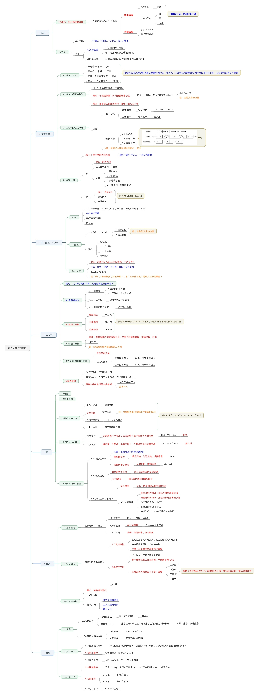

## NOTES:

```bash
git clone https://github.com/dybl/awesome_C.git
git pull
```
- This awesome repository contains a lot of resource about C/C++,
- you may learn it from get start to be a master



## TODO
...
