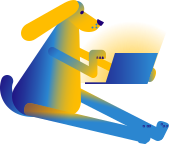

<!--  封面  -->

# Awesome_C <small>0.0.1</small>

> Collections for funny code which write with c programming language !

<!--
- Simple and lightweight
- All source code compile and debug passing with GCC
- Multiple Funuy Directory

[GitHub](#) -->
<!-- [Get Started](base-quickstart.md) -->

